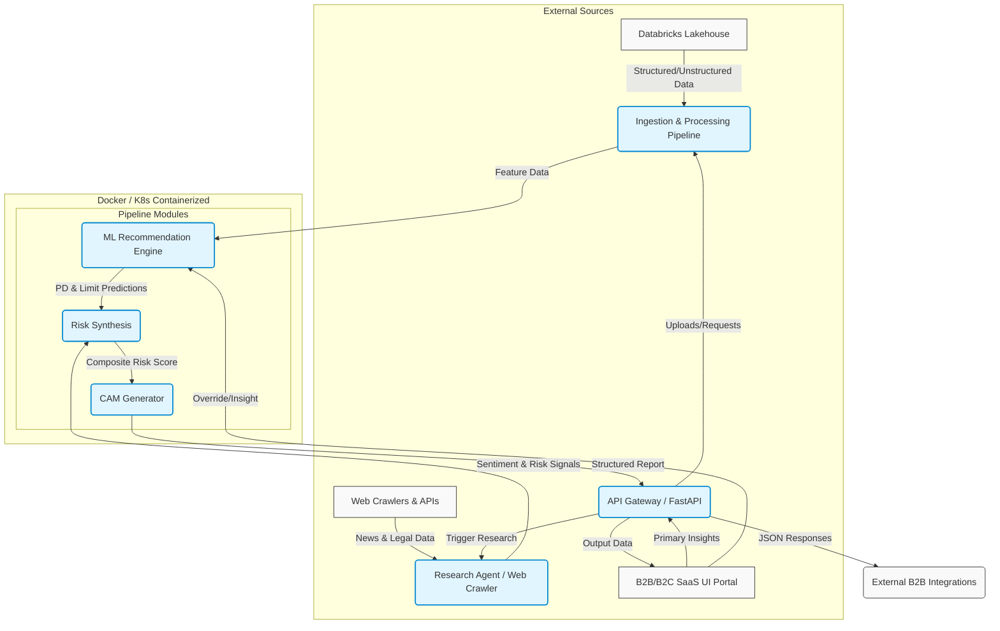

# Intelli-Credit System Architecture

This document outlines the architecture, data flow, and technology stack for the Intelli-Credit decisioning engine.

## Architecture Diagram (Mermaid.js)

## Technology Stack Selection

**Backend API & Microservices:**
- **Framework:** Python 3.11 with FastAPI (High performance, async native, automatic OpenAPI docs).
- **Server:** Uvicorn (ASGI server).

**Data Ingestion & Processing (High Latency Pipeline):**
- **Processor:** Databricks (Lakehouse architecture for handling massive multi-tenant data).
- **Driver:** `databricks-sql-connector` for python or PySpark depending on scale.
- **PDF Parsing (Scanned Indian PDFs):** `pdfplumber` combined with OCR (`tesseract` via `pytesseract` for scanned image-based PDFs common in Indian statutory filings).

**Web Web Crawler / Research Agent:**
- **Crawling/Scraping:** `beautifulsoup4` and `httpx` (async HTTP requests) for general web scraping.
- **Legal & Compliance:** Explicit integrations via APIs (e.g., e-Courts integrations if available, MCA scraping proxy).
- **NLP / Sentiment Analysis:** Can leverage local LLM models or HuggingFace transformers for sentiment analysis on scraped news (mocked in logic wrapper for now).

**ML Recommendation Engine:**
- **Modeling:** `scikit-learn`, `xgboost`, or `lightgbm` for explainable tree-based models (Probability of Default, Credit Limits).
- **Explainability:** `shap` (SHapley Additive exPlanations) to explicitly detail why a rejection or specific limit was recommended.

**Frontend:**
- **Framework:** Next.js (React) for B2B/B2C B2B SaaS portal.

**Containerization & Deployment:**
- **Containers:** Docker.
- **Orchestration:** Kubernetes (K8s) manifests or Docker Compose for local environments.

## Core Component Overview

1.  **Data Ingestion Pipeline (Databricks natively embedded):** Extracts GST filings, ITRs, and Bank statements via Databricks. Parses unstructured annual reports handling GSTR-2A vs 3B nuances.
2.  **Research Agent:** An automated crawler that investigates promoters, MCA filings, and disputes.
3.  **ML Decisioning & Explainability:** Non-black-box model predicting PD and limits, explicitly tied to SHAP values for root-cause analysis (e.g., "Limit reduced by 20% due to ongoing litigation found on e-Courts").
4.  **CAM Generator:** Synthesizes the Five C's into a final document for the B2B API to consume.
